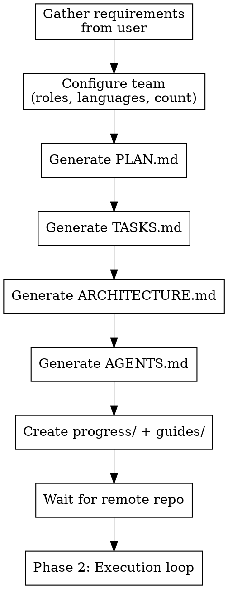

# Project Orchestration

## Overview

Scaffolds and manages multi-agent project development using **file-based coordination**. Every agent reads the same files in the repo — works identically in Claude Code, Codex, or any agent environment.

**Core principle:** The repo IS the coordination layer. No platform-specific messaging required.

## When to Use

- Starting a greenfield project with multiple agents
- Setting up PR-based workflows with dependency tracking
- Need structured planning before any code is written
- Coordinating agents across different platforms (Claude Code + Codex)
- Want TDD enforced from day one

**Don't use for:** Solo projects, quick scripts, single-file changes.

## Process



### Phase 1: Dry Implementation

Generate ALL documentation before writing any code:

1. **Gather requirements** — Ask user for vision, constraints, tech stack
2. **Configure team** — Ask user for team composition (see Team Configuration below)
3. **Generate PLAN.md** — Vision, architecture overview, phases, constraints
4. **Generate TASKS.md** — Checkboxed tasks with blockers, assignees, test criteria
5. **Generate ARCHITECTURE.md** — System diagram, directory structure, component registry, conventions
6. **Generate AGENTS.md** — Universal entry point for all agents (references ARCHITECTURE.md + progress/)
7. **Create progress/** — One file per task, named by status prefix
8. **Create guides/** — getting-started, pr-workflow, testing-strategy, coding-conventions
9. **Wait for remote repo** — User confirms repo is ready

### Phase 2: Execution

Task assignment loop:

1. Lead assigns task → agent reads AGENTS.md → reads ARCHITECTURE.md → reads progress/
2. Agent creates branch `task/TASK-XXX-description` from latest main
3. Agent writes tests first (TDD), then implementation
4. Agent updates progress file: rename `not-started-TASK-XXX` → `in-progress-TASK-XXX`
5. Agent opens PR (1 task = 1 PR), links blocking PRs
6. Both reviewers review (split focus — see Team Roster)
7. CI green + both approvals + blockers merged → merge
8. Rename progress file → `merged-TASK-XXX`
9. Lead assigns next task

## Team Configuration

On invocation, ask the user:

1. **How many engineers?** (default: 3)
2. **What languages/specialties?** (default: 1 Rust + 2 TypeScript)
3. **Custom role names?** (default: generic)

Base roles (always present):

| Role | Focus | Always Present |
|------|-------|---------------|
| **Team Lead** | Architecture, orchestration, owns PLAN/TASKS/ARCHITECTURE | Yes |
| **Senior Reviewer 1** | Correctness, security, clarity, API design | Yes |
| **Senior Reviewer 2** | Performance, test coverage, edge cases, resource mgmt | Yes |
| **Engineer(s)** | Implementation, TDD, progress updates | Configured per project |

Default example: 1 Rust engineer + 2 TypeScript engineers = 6 agents total.

See `references/agent-prompts.md` for full system prompts.

## Generated Files

All templates are in `references/file-templates.md`. Key files:

| File | Purpose | Updated By |
|------|---------|-----------|
| `PLAN.md` | Vision, architecture, phases, constraints | Lead |
| `TASKS.md` | Task list with PR links, blockers, assignees | Lead |
| `ARCHITECTURE.md` | System diagram, components, conventions, changelog | Lead + Engineers |
| `AGENTS.md` | Universal entry point — required reading for ALL agents | Lead |
| `progress/` | One file per task, status in filename | Engineers |
| `guides/` | Getting started, PR workflow, testing, conventions | Lead |

### AGENTS.md — The Universal Entry Point

Every agent, on every session start, MUST:

1. Read `AGENTS.md`
2. Read `ARCHITECTURE.md`
3. Read relevant files in `progress/`
4. Read their assigned task in `TASKS.md`

This is non-negotiable regardless of platform.

## PR Workflow

See `references/workflow-rules.md` for complete rules. Summary:

- **Branch naming:** `task/TASK-XXX-short-description`
- **One PR per task** — small PRs, clear audit trail
- **Dependency linking:** PR description lists blocking PRs
- **Review gates:** Both reviewers approve + CI green + blockers merged
- **TDD enforcement:** Reviewers flag any code without tests-first evidence
- **Merge:** Squash merge to main, delete branch

## Progress File Lifecycle

```
progress/not-started-TASK-001-setup-db.md
progress/in-progress-TASK-002-auth-api.md
progress/review-TASK-003-user-model.md
progress/merged-TASK-004-health-check.md
```

`ls progress/` shows all task states at a glance — no parsing needed.

## Red Flags

- Code committed without tests → TDD violation, reject PR
- Progress file not updated → agent skipped coordination protocol
- Direct push to main → must use PR workflow
- Skipped review → both reviewers must approve
- Stale progress files → agent abandoned task without updating
- ARCHITECTURE.md not updated after structural changes

## Agent-Agnostic Notes

### Claude Code
- Use `TeamCreate` to spawn agents
- Use `SendMessage` for coordination
- Agents read repo files directly

### Codex
- Each agent is a separate Codex session
- Point each session at AGENTS.md first
- Use PR comments for cross-agent communication

### Mixed Environments
- File-based coordination works across any combination
- AGENTS.md is the single source of truth
- Progress files are the shared state
